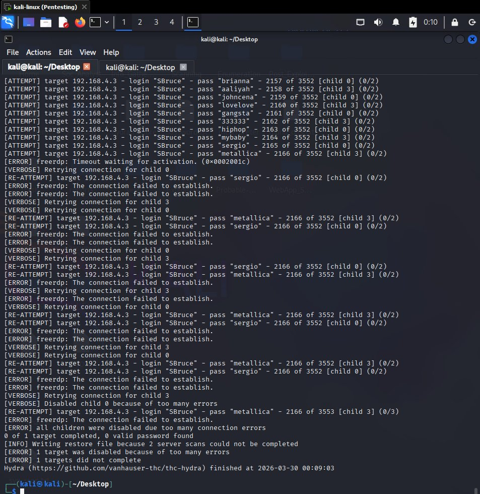
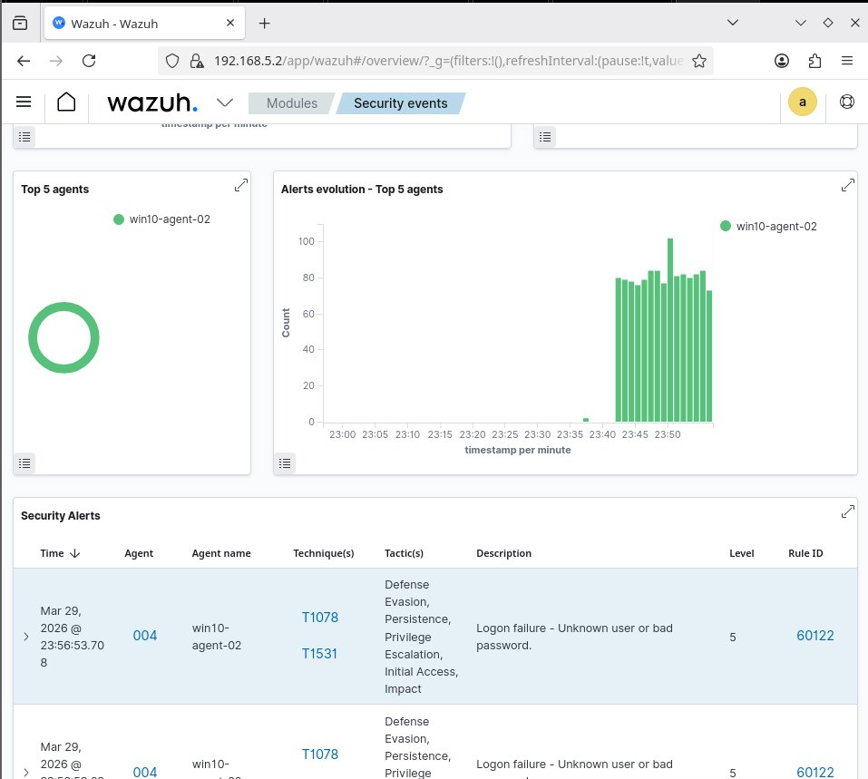
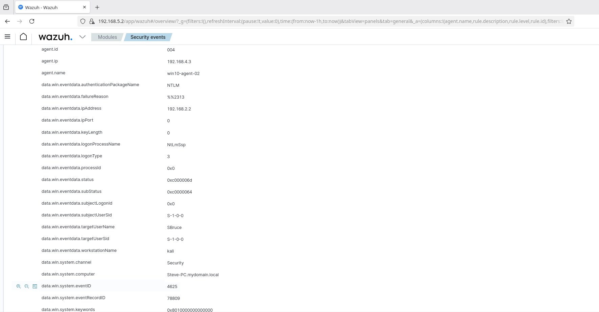
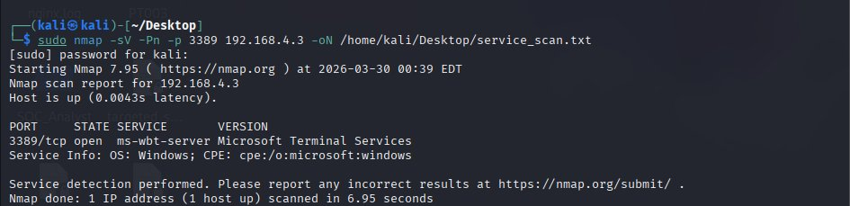
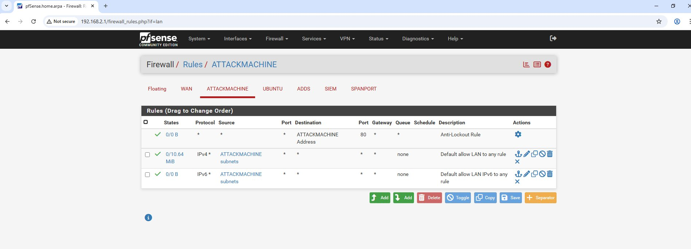
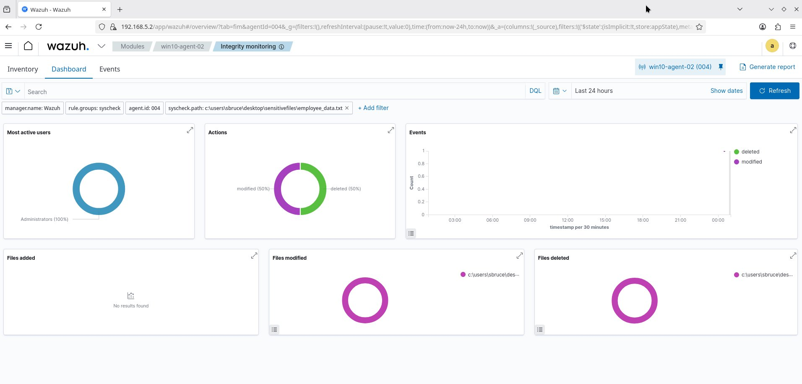
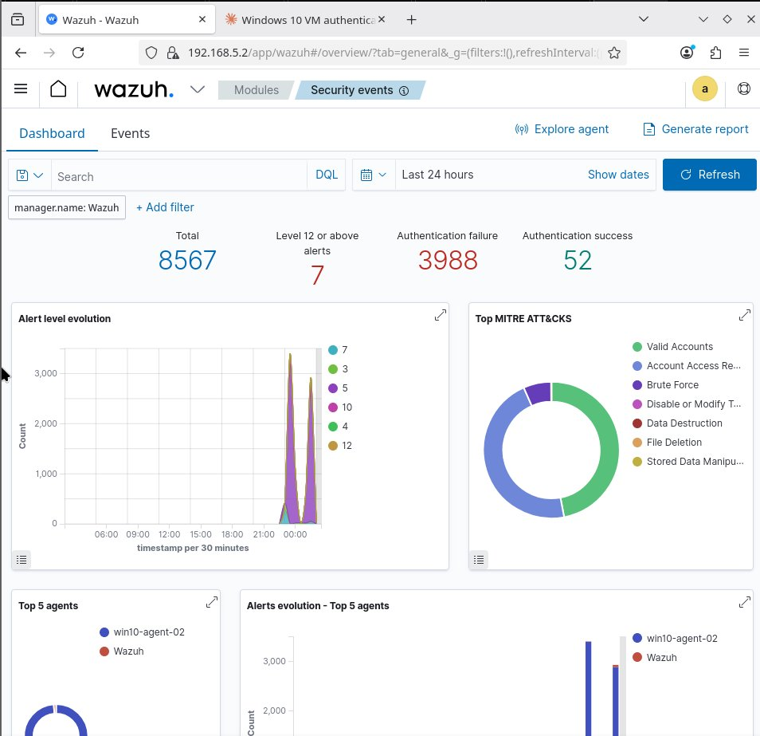

SOC Home Lab: Network Segmentation, SIEM Deployment & Threat Detection
A segmented Security Operations Centre lab built with six virtual machines across four isolated subnets, featuring Wazuh SIEM, pfSense firewall, Active Directory, and real attack simulations with custom detection engineering.
> **Inspired by** [Sean Nanty's](https://medium.com/@nantysean) detection and monitoring home lab series — adapted and extended with my own attack simulations, troubleshooting, and detection engineering.
---
Lab Architecture
Hypervisor: VMware Workstation
VM	OS	IP Address	Subnet	Role
pfSense	FreeBSD	192.168.2.1	All subnets	Firewall / inter-VLAN router
Kali Linux	Kali	192.168.2.2	Attacker (192.168.2.0/24)	Attack simulation
Windows 10	Windows 10	192.168.4.3	Corporate LAN (192.168.4.0/24)	Target endpoint + Wazuh agent
Windows Server	Windows Server	192.168.4.x	Corporate LAN (192.168.4.0/24)	Active Directory + DNS
Ubuntu VM	Ubuntu	192.168.3.2	Monitoring (192.168.3.0/24)	Reserved for future monitoring
Wazuh Manager	Debian	192.168.5.2	SIEM (192.168.5.0/24)	Centralised SIEM
The attacker (Kali) sits on a different subnet from the target (Windows 10) and the SIEM (Wazuh). All inter-subnet traffic routes through pfSense, replicating enterprise network segmentation.
---
Attack Simulations & Detection
Scenario 1: RDP Brute Force Attack
Attack: Hydra credential stuffing against Windows 10 RDP (port 3389) with 3,550 passwords.
```bash
hydra -l SBruce -P /home/kali/passwords.txt rdp://192.168.4.3 -t 4 -vV
```
Detection: Wazuh captured 3,988 authentication failure events (Event ID 4625). Source IP, workstation name, and NTLM logon type were all visible. MITRE ATT&CK auto-mapped to T1078 and T1110.

Hydra running credential stuffing — 2,166 attempts before RDP stopped responding

Wazuh alert list — Rule 60122 firing with MITRE T1078/T1531 mapping

Alert detail — source IP 192.168.2.2, Event ID 4625, status 0xc000006d
---
Scenario 2: Network Reconnaissance (Nmap)
Attack: SYN stealth scans, targeted service scans, and version detection from Kali.
```bash
sudo nmap -sS -Pn -p 1-1000 192.168.4.3
sudo nmap -sS -Pn -p 135,139,445,3389,5985 192.168.4.3
sudo nmap -sV -Pn -p 3389 192.168.4.3
```
Findings: All 1,000 ports filtered except RDP (3389). pfSense blocked reconnaissance effectively. Version detection identified Microsoft Terminal Services on Windows.
Security finding: The attacker interface had a default "allow LAN to any" rule with no logging — scans passed through without being recorded.

Nmap version detection — RDP identified as Microsoft Terminal Services

pfSense attacker interface — overly permissive "allow LAN to any" rule
---
Scenario 3: File Integrity Monitoring (FIM)
Setup: Added custom syscheck directive to monitor a sensitive directory in real time.
```xml
<directories check_all="yes" realtime="yes" report_changes="yes">
  C:\Users\SBruce\Desktop\SensitiveFiles
</directories>
```
Detection: Wazuh captured file modification and deletion events with path details and user attribution. MITRE mappings: T1485, T1565, T1070.004.

FIM dashboard — file modification and deletion detected
---
Scenario 4: Custom Wazuh Detection Rule
Problem: Default rule 60122 flags every failed logon as level 5 — no distinction between a typo and a brute force attack.
Solution: Custom correlation rule that escalates to level 12 when 8+ failures occur within 120 seconds:
```xml
<group name="custom_brute_force,">
  <rule id="100001" level="12" frequency="8" timeframe="120">
    <if_matched_sid>60122</if_matched_sid>
    <description>CUSTOM: RDP brute force attack detected</description>
    <mitre>
      <id>T1110</id>
    </mitre>
  </rule>
</group>
```
Result: 7 high-severity (level 12) alerts appeared — up from zero. "Brute Force" now shows as a distinct MITRE ATT&CK category.

Dashboard after custom rule — 7 Level 12 alerts, Brute Force in MITRE ATT&CK chart
---
Troubleshooting: Wazuh Agent "Never Connected"
After agent registration, the dashboard showed "Never connected." Diagnosed in 6 steps:
Network check: `Test-NetConnection 192.168.5.2 -Port 1514` → `TcpTestSucceeded: True` ✅
Service status: `Get-Service WazuhSvc` → `Stopped` ❌
Start attempt: Failed — PowerShell not running as Administrator
Elevated start: Service started then immediately stopped
Log analysis: `ossec.log` showed `Invalid server address: 0.0.0.0` → `No client configured. Exiting.`
Fix: Updated `ossec.conf` server address from `0.0.0.0` to `192.168.5.2` → Agent connected immediately ✅
This mirrors real-world SOC operations where agents deployed via templates ship with placeholder addresses.
---
MITRE ATT&CK Coverage
Technique	Name	Detection Method
T1110	Brute Force	Custom Wazuh rule 100001
T1078	Valid Accounts	Wazuh rule 60122
T1046	Network Service Scanning	Nmap + pfSense log correlation
T1485	Data Destruction	Wazuh FIM
T1565	Stored Data Manipulation	Wazuh FIM
T1070.004	Indicator Removal: File Deletion	Wazuh FIM
---
Key Takeaways
Detection engineering > tool deployment. Custom correlation rules distinguish noise from real attacks.
Segmentation must be verified. Nmap proved pfSense was filtering, but the permissive attacker rule and missing logs were production-unacceptable gaps.
Troubleshooting is the real skill. Diagnosing the agent issue required working across network, service, log, and config layers.
Visibility requires configuration. FIM only works for directories you explicitly define.
---
Tools & Technologies
Category	Tools
SIEM	Wazuh (manager, agent, dashboard)
Firewall	pfSense Community Edition
Attack tools	Hydra, Nmap
Virtualisation	VMware Workstation
Operating systems	Debian, Ubuntu, Windows 10, Windows Server, Kali Linux
Protocols	RDP, NTLM, Active Directory, DNS, Syslog
---
Author
Jeffrey — MSc Cybersecurity, University of Sunderland 
